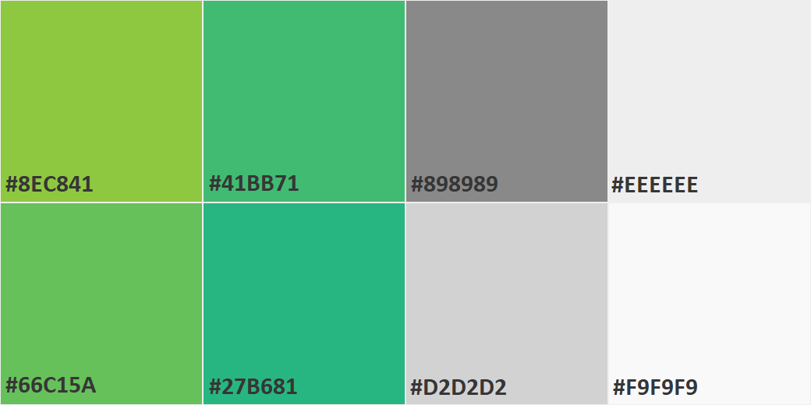

# Style Guide

## Tables of Contents
> ## Naming Conventions
> ## Comments
> ## IPC Colors

## Naming Conventions
- Variables : snake_case : all words are lowercase and are separated by '_'
- HTML Atrributes : html-snake-case : all words are lowercase and are separated by '-' 
- Functions : lowerCamelCase : starts with a lowercase letter and following words start with uppercase letters with no spaces between words
- Tables :  UpperCamelCase : all words start with capital letters with no spaces between words
- Table Fields : lower spaced out : all words are lowercase and normally spaced
- Script Includes : Upper Spaced Out : all words start with an uppercase letter and are normally spaced

### Variables: snake_case
example: 
```js
var this_is_a_long_variable_name = 0;
```

### HTML Attributes: html-snake-case  
example:
```html
<div this-is-a-long-attribute-name="foo">...</div>
```

### Functions: lowerCamelCase 
example:
```js
function thisIsALongFunctionName(param_1, param_2, ...)
```

### Tables: Upper Spaced Out
NOTE: tables should be singular (e.g., a table contianing fruits should be called 'Fruit' not 'Fruits')
example:  
> A table containing fruits should be called 'Fruit' not 'Fruits'
> 'Vehicle Model' instead of 'Vehicle Models'

### Table Fields: Upper Spaced Out
NOTE: when accessing a field via GlideRecord, table names will be snake_case.  
example:  
> Priority Number
> priority_number [when field is accessed via GlideRecord)

### Script Includes: UpperCamelCase
example:  
> SetNumberOfTimes

Quick Tip for when declaring static Script Include functions:  
> You can declare a static Script Include function by adding `ScriptIncludeName.functionName = function()` after createing the prototye.  

 example:   
> Declare static function foo on FooUtils:  
> ```js
> var FooUtils = class.create();
> FooUtils.prototype = {
>   initialize: function() {...},
> 
>   type: 'FooUtils'
> };
>
> FooUtils.foo = function(foo_1) {...};
> ```

## Comments
All functions should be commented on.  They should be formatted in the following way (replacing | | with what's described inside of them):
```js
/**
 * |Describe functionality|
 * @param {|parameter type|} |parameter name| |what the parameter should be|
 * ...
 * @return {|return type|} |what should be returned|
 */
function foo(param_1){...}
```
example:  
```js
/**
 * Fooifys the two parameters.
 * @param {String} param_1 The first item to fooify
 * @param {String} param_2 The second item to fooify
 * @return {Object} param_1 and param_2 fooified together
 */
function fooify(param_1, param_2) {
	var rv = {};
	// Do Something...
	return rv;
}
```
Quick Tip
> This function commenting format will allow VSCode to display the function information when hovering over it

## IPC Colors
